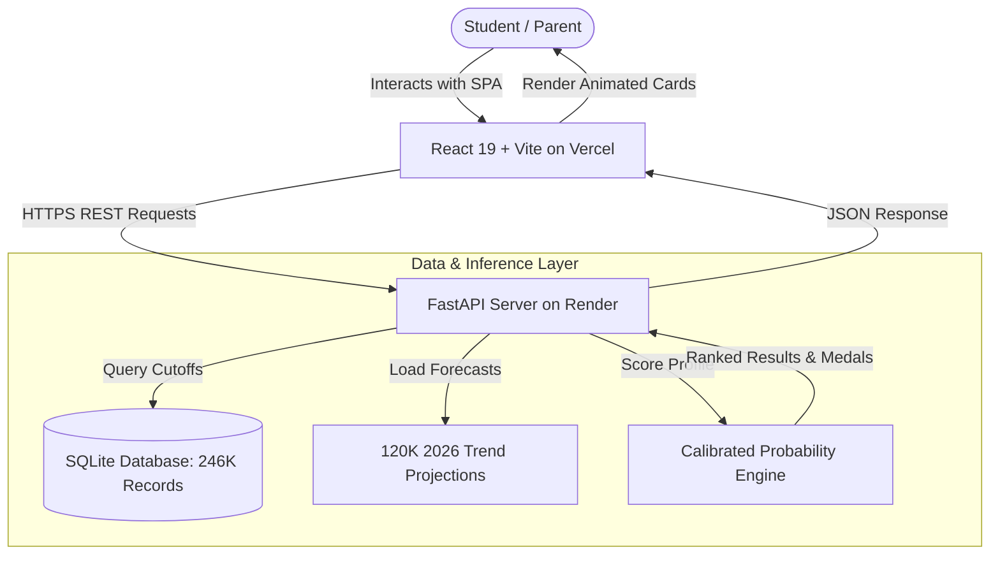

# 🚀 First-Fly — AI Admission Intelligence & College Recommendation Engine

> **A full-stack data platform and machine learning engine analyzing 246,110 official MHT-CET cutoff records across 408 engineering colleges in Maharashtra.**

---

## 🔗 Live Deployments & Interactive Links

| Platform | Direct Live Link | Description |
|---|---|---|
| 🌐 **Production Web App** | **[https://first-fly.vercel.app](https://first-fly.vercel.app)** | Complete React Single Page App — test predictions, search branches, and view admission probabilities |
| ⚡ **Live Backend API** | **[https://first-fly-api.onrender.com](https://first-fly-api.onrender.com)** | High-performance FastAPI server running on Render |
| 📖 **Interactive Swagger API Docs** | **[https://first-fly-api.onrender.com/docs](https://first-fly-api.onrender.com/docs)** | Explore and execute live API calls directly in your browser |
| 📚 **ReDoc API Reference** | **[https://first-fly-api.onrender.com/redoc](https://first-fly-api.onrender.com/redoc)** | Detailed REST endpoint schemas and data models |

---

## 🎯 Executive Summary & The Problem

Every year, over **400,000 students** participate in the Centralized Admission Process (**CAP**) for Maharashtra Engineering admissions. Students and parents face significant hurdles:
- **Information Overload:** Sifting through 240K+ rows of unstructured PDF cutoffs across 400+ colleges and 95+ reservation categories.
- **Decision Uncertainty:** Inability to assess true admission chances (Safe vs. Moderate vs. Reach).
- **Year-on-Year Trend Volatility:** Historical numbers don't account for rising/falling cutoff shifts for upcoming admission cycles.

**First-Fly** solves this by transforming official State CET Cell data into an interactive, real-time recommendation engine powered by machine learning and multi-year linear trend projections.

---

## 📊 Key Engineering Metrics

| Metric | Value | Technical Context |
|---|---|---|
| **Records Ingested** | **246,110** | Extracted from 12+ official CET Cell PDF circulars (2022–2025) |
| **Colleges Indexed** | **408** | Government, Autonomous, University & Private institutes |
| **Branch Coverage** | **117** | Normalized 10-digit DTE codes & branch taxonomy |
| **2026 AI Projections** | **120,653** | Multi-year linear regression forecasts |
| **Query Latency** | **< 20ms** | High-performance index lookups + in-memory scoring |
| **Categories Supported** | **95+** | OPEN, OBC, SC, ST, SEBC, EWS, TFWS, Ladies, Home University, Defence, PWD |

---

## 🏗️ System Architecture & Data Flow

---

## 🔬 Data Engineering & ML Methodology

### 1. Extraction & Normalization Pipeline (ETL)
- **PDF Ingestion:** Custom regex table parser extracting tabular cutoff data from unstructured CET Cell PDF releases.
- **Taxonomy Normalization:** Unified 9-digit (legacy 2022) and 10-digit DTE branch codes into a standardized hierarchy.
- **Database Indexing:** Indexed by `(year, category, branch_name, round)` to achieve sub-20ms queries.

### 2. Multi-Year Trend Projections (2026 Cutoffs)
For every unique `(college, branch, category, round)` tuple:
- **4 historical points (2022–2025):** Least-squares linear regression modeling year-on-year shift.
- **2–3 points:** Linear extrapolation.
- **1 point:** Direct latest cutoff carry-over.
- Clamped within valid MHT-CET bounds `[0.1, 100.0]`.

### 3. Calibrated Admission Probability
Scores user percentile against cutoff thresholds to classify admission feasibility:
- 🟢 **SAFE (≥ 75% Probability):** High confidence of securing a seat in that round.
- 🟡 **MODERATE (48% – 74% Probability):** Competitive match.
- 🔴 **DREAM (< 48% Probability):** Reach school target.

---

## 💡 Key Technical Challenges & Solutions

| Challenge | Engineering Solution |
|---|---|
| **CORS & Multi-Environment Preflights** | Configured dynamic regex origin matching `https://.*\.vercel\.app.*` with wildcard headers to seamlessly support preview, staging, and production frontend deployments. |
| **Zero-Friction Discovery** | Designed instant client-side acronym resolution (`CSE`, `IT`, `AIML`, `EXTC`) and decoupled public search from auth dependencies. |
| **Cloud Ephemeral File Paths** | Engineered multi-path fallback discovery logic to locate datasets across varied container root directories. |

---

## 📡 REST API Interface

### `GET /api/v1/recommendations/`
Returns ranked college recommendations with admission probability.

#### Request Parameters
- `percentile` *(float, required)*: MHT-CET percentile (`0.0` to `100.0`)
- `category` *(string, required)*: Reservation category (e.g. `OPEN`, `OBC`, `EWS`)
- `branch_name` *(string, required)*: Engineering branch title
- `year` *(int, required)*: `2022`–`2025` (Historical) or `2026` (AI Projected)
- `round_num` *(int, optional)*: CAP Round: `1`, `2`, or `3`
- `min_status` *(string, optional)*: Filter by `SAFE`, `MODERATE`, or `DREAM`
- `top_n` *(int, optional)*: Max results to return (default: `50`)

---

## 💻 Tech Stack

- **Frontend:** React 19, Vite, CSS Glassmorphism & Aurora UI Tokens
- **Backend:** Python 3.11, FastAPI, Pydantic, SQLAlchemy, Uvicorn
- **Machine Learning & Data:** scikit-learn, pandas, NumPy
- **Infrastructure & Hosting:** Vercel (Frontend SPA), Render (Backend REST API)

---

## 📄 License & Proprietary Rights

**Copyright © 2026 Shrey Mangle. All Rights Reserved.**

This repository and all associated documentation, system design, algorithms, models, and assets are the proprietary intellectual property of Shrey Mangle.

- **Strictly for evaluation and recruitment assessment.**
- **No unauthorized copying, reproduction, distribution, sublicensing, reverse-engineering, or commercial use is permitted.**

---

  Built by <strong>Shrey Mangle</strong>. Tested with live Maharashtra CAP data.

